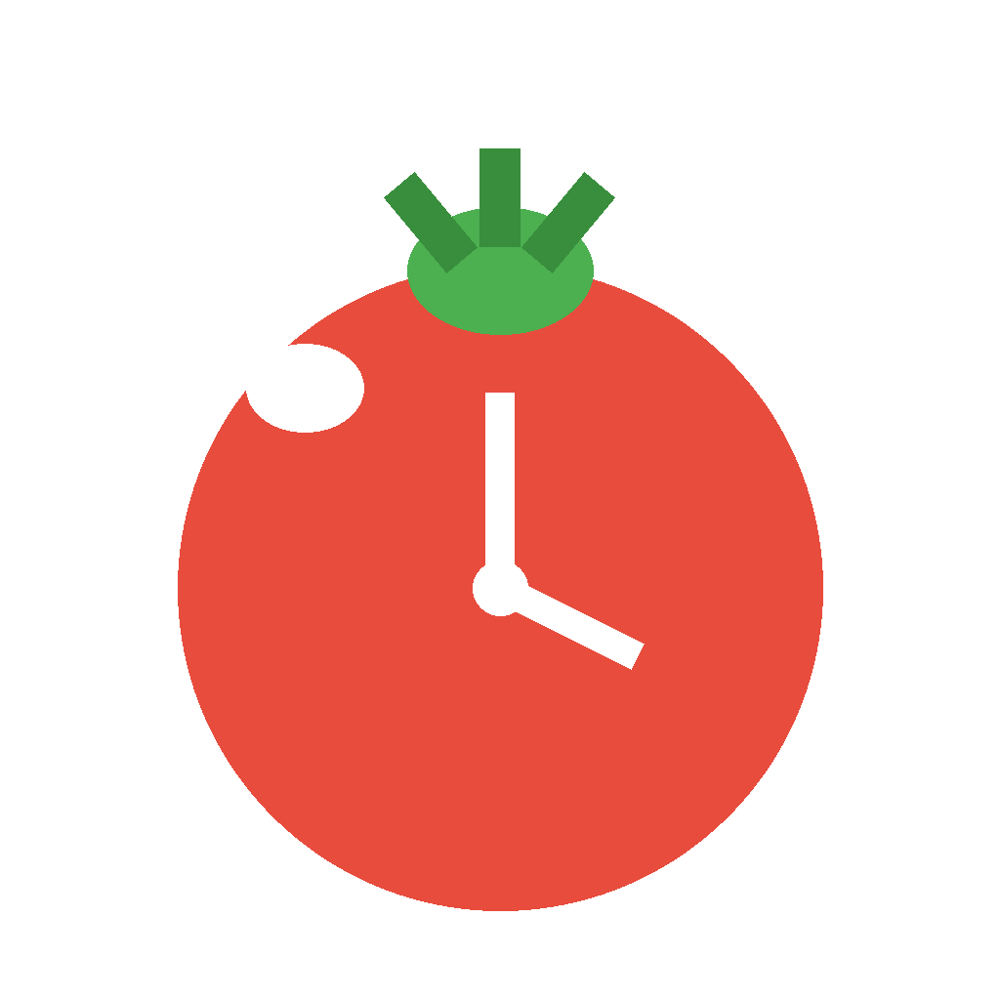

# 🍅 Pomodoro — macOS 悬浮番茄钟

一个轻量的 macOS 桌面番茄钟小工具：平时缩成屏幕角落的迷你悬浮条，计时结束才弹出确认，不打断你的工作流。

## 特性

- **悬浮迷你条** — 计时中缩成一条小胶囊置顶显示（所有空间可见），可拖到任意位置
- **到点才打扰** — 专注/休息结束时窗口自动弹出，弹确认卡片：开始休息 / 跳过休息，点了才走
- **番茄工作法循环** — 可配置「每 N 个番茄进入长休息」，圆点显示本轮进度
- **统计** — 今日番茄数、今日专注分钟数、累计番茄数，本地保存
- **主题自定义** — 5 套预设配色 + 三模式独立取色器
- **提示音 & 通知** — 完成时和弦琶音提示（网页版另有桌面通知）
- **快捷键** — 空格键开始/暂停

## 截图

<p align="center">
  
</p>

## 安装

**方式一：自己构建**（推荐，干净放心）

```bash
git clone https://github.com/harryniu1990/pomodoro-mac.git
cd pomodoro-mac
./build.sh
open Pomodoro.app
```

依赖：Xcode Command Line Tools（`xcode-select --install`）。
图标生成需要 Python + Pillow（可选，没有也能正常用）。

> 首次运行若被 Gatekeeper 拦截（未签名），在终端执行：
> `xattr -cr Pomodoro.app` 后再打开。

## 技术架构

| 文件 | 说明 |
|---|---|
| `src/index.html` | 单文件前端：计时逻辑、迷你条、确认卡片、主题系统（无任何依赖） |
| `src/main.swift` | 原生外壳：无边框置顶悬浮窗（WKWebView），窗口大小切换、拖拽、焦点控制 |
| `build.sh` | 一键构建脚本：swiftc 编译 → 打包 .app → 生成 icns 图标 |

前后端通过 `WKScriptMessageHandler` 通信：JS 发送 `mini / full / done / quit / move` 消息，Swift 响应窗口动画、焦点抢夺和位移。

## 使用

- **缩小**：完整界面右上角 `—`，缩成悬浮条
- **展开**：点悬浮条上的时间或 `⤢`
- **拖动**：按住任意非按钮区域拖动（两种形态都支持）
- **移动窗口到全屏之上**：窗口级别为 floating，切到任何桌面都能看到
- **退出**：完整界面左上角 `×` 或 `⌘Q`（不占 Dock）

## License

MIT
